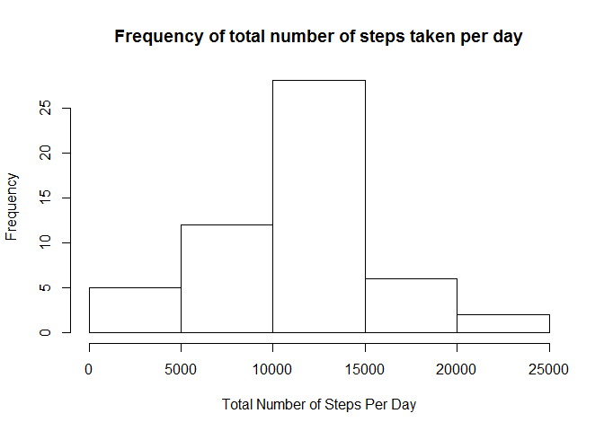
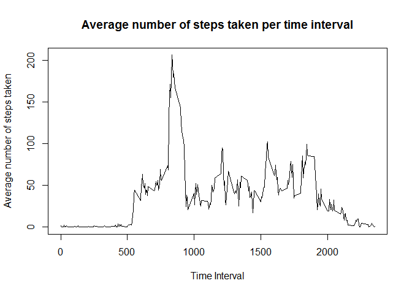
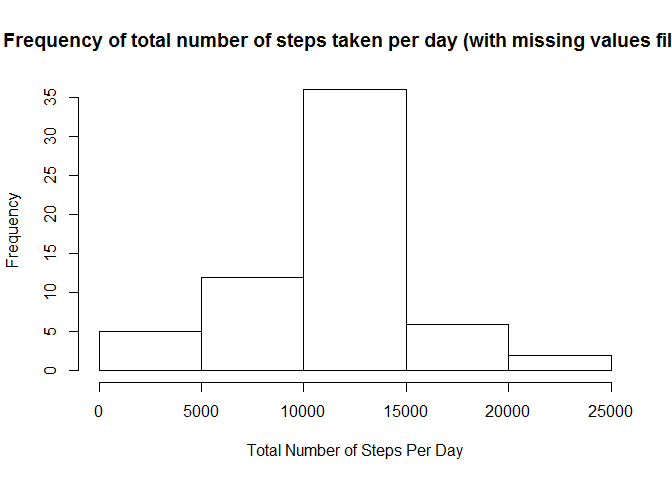
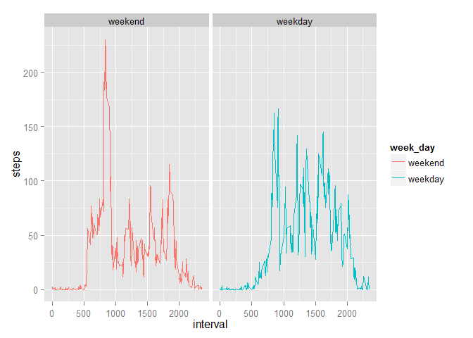

# Reproducible Research: Peer Assessment 1


## Loading and preprocessing the data

```r
df <- read.csv("activity.csv", stringsAsFactors=FALSE)
```


## What is mean total number of steps taken per day?
Let's look at the histogram, mean and median of the total number of steps taken each day. 

```r
# Sum up steps by date first
dfByDay <- aggregate(steps ~ date, data=df, FUN=sum, na.rm=TRUE)
hist(dfByDay$steps, 
     main="Frequency of total number of steps taken per day", 
     xlab="Total Number of Steps Per Day")
```

 


```r
meanSteps <- format(round(mean(dfByDay$steps, na.rm=TRUE)), digits=5)
medianSteps <- format(round(median(dfByDay$steps, na.rm=TRUE)), digits=5)
```

Mean of total number of steps taken per day is:  10766.  
Median of total number of steps taken per day is: 10765.


## What is the average daily activity pattern?
Below is a plot of the 5-minute interval and the average number of steps taken, averaged across all days. 

```r
# Calculate the average number of steps acros all days for each interval
dfByInterval <- aggregate(steps ~ interval, data=df, FUN=mean)
plot(dfByInterval$interval, dfByInterval$steps, type="l", 
     main="Average number of steps taken per time interval", 
     ylab="Average number of steps taken", 
     xlab="Time Interval")
```

 


```r
maxInterval <- dfByInterval[dfByInterval$steps==(max(dfByInterval$steps)),]$interval
```

The 5-minute interval which contains the maximum number of steps,  on average across all the days in the dataset, is 835.

## Imputing missing values

```r
NASteps <- df[is.na(df$steps), ]
noOfNASteps <- nrow(NASteps)
```

Total number of missing values in the dataset is 2304.

The presence of missing days may introduce bias into some calculations or summaries of the data. To address this, we'll fill in all of the missing values with the the mean for that 5-minute interval.


```r
# Use join in plyr package to get the mean steps for each interval
library("plyr")
NAStepsFilled <- join(NASteps, dfByInterval, by=c("interval"))
# Remove the original steps column which are NAs
NAStepsFilled <- NAStepsFilled[, -c(1)]

# Remove NAs from original data set
newdf <- df[complete.cases(df),]
# add back the NA rows with mean data filled in 
newdf <- rbind(newdf, NAStepsFilled)
```


```r
# Sum up steps by date first
newdfByDay <- aggregate(steps ~ date, data=newdf, FUN=sum, na.rm=TRUE)
hist(newdfByDay$steps, 
     main="Frequency of total number of steps taken per day (with missing values filled)", 
     xlab="Total Number of Steps Per Day")
```

 


```r
newMeanSteps <- format(round(mean(newdfByDay$steps)), digits=5)
newMedianSteps <- format(round(median(newdfByDay$steps)), digits=5)
```

Mean of total number of steps taken per day is:  10766.  
Median of total number of steps taken per day is: 10766.

By comparing the histgrams, mean and median numbers before and after filling in the missing values, we can see that the mean stays unchanged, while median has a slight increase, and the bin in the histgram which contains the mean has higher frequrency count. this can be explained by that we replaced the NAs by the mean, and the original mean ignored the NAs, so the new mean is the same as original mean. The median increases because NAs are replaced by positive numbers so median becomes larger. And there are more steps whose count is mean, because previous NAs are replaced by mean. 

## Are there differences in activity patterns between weekdays and weekends?
Below is a plot of the 5-minute interval and the average number of steps taken, averaged across all weekday days or weekend days. The data set is the new data set which has all NAs filled in.


```r
newdf$date <- as.Date(newdf$date, "%Y-%m-%d") 
newdf$week_day <- factor((weekdays(newdf$date) %in% c("Saturday", "Sunday")), label=c("weekend", "weekday"))

# Calculate the average number of steps acros all days for each interval
newdfByInterval <- aggregate(steps ~ interval + week_day, data=newdf, FUN=mean)

library(ggplot2)
ggplot(newdfByInterval) + geom_line(aes(interval, steps, group = week_day, color = week_day)) + facet_wrap(~week_day)
```

 

```r
maxSteps <- max(newdfByInterval$steps)
maxStepsFormatted <- round(maxSteps)
maxNewInterval <- newdfByInterval[newdfByInterval$steps==maxSteps,]$interval
```

The plot shows that on average the number of steps are mostly below 160 for each interval on weekdays, while on weekends on average the number of steps are mostly below 120 per interval, but there is a spike of 230 at interval 835.This is the same interval as we observed earlier which contains maximum number of steps,  on average across all the days in the original dataset. This means this person in general is physically more active at 8:35am on weekends. 

